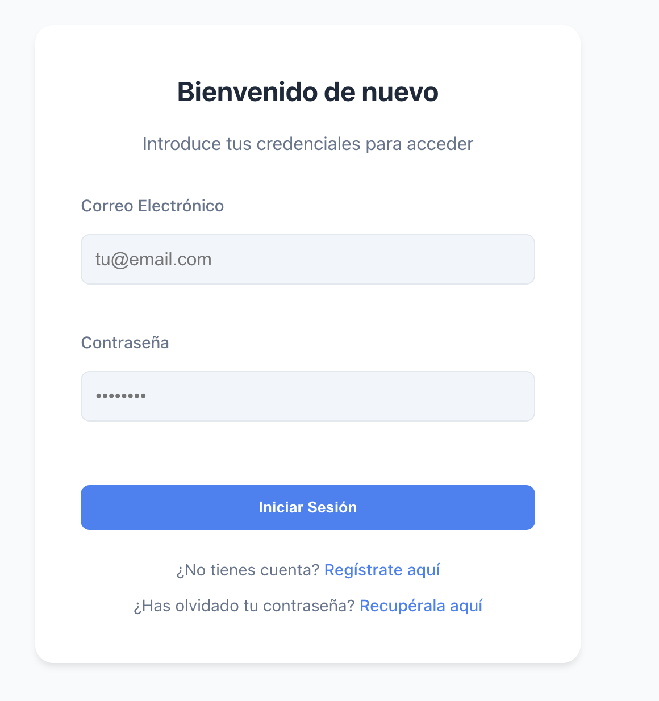
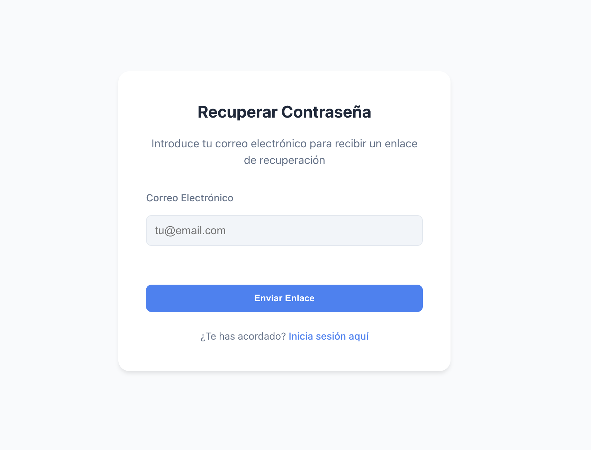
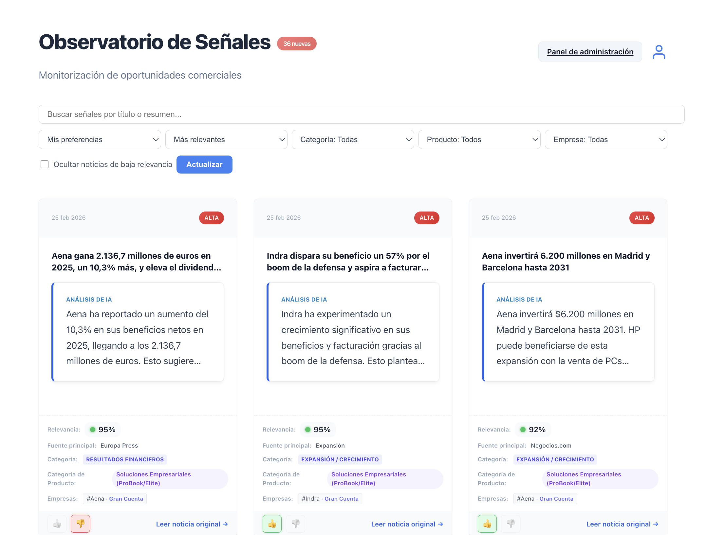
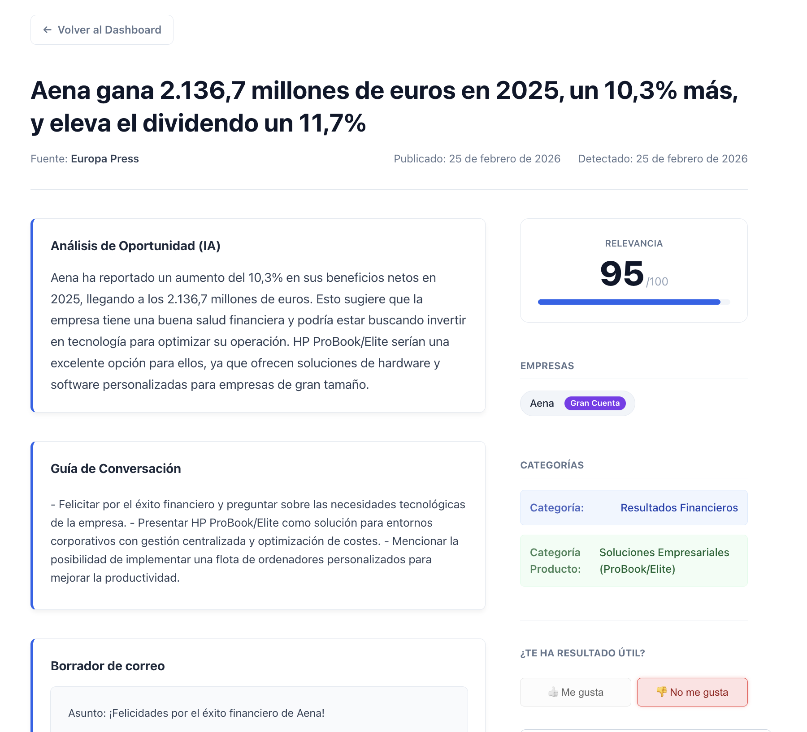
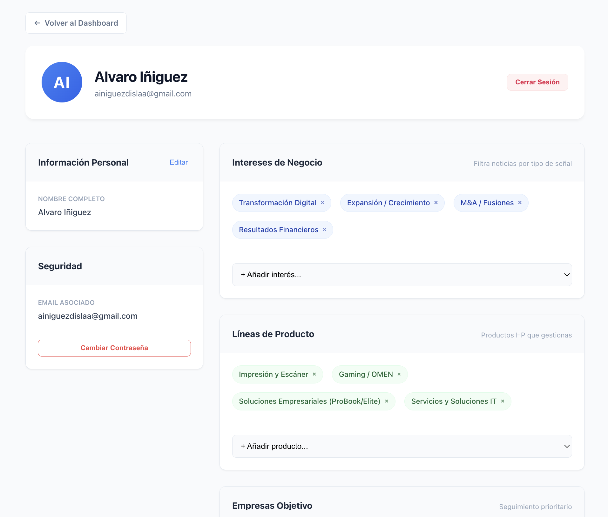
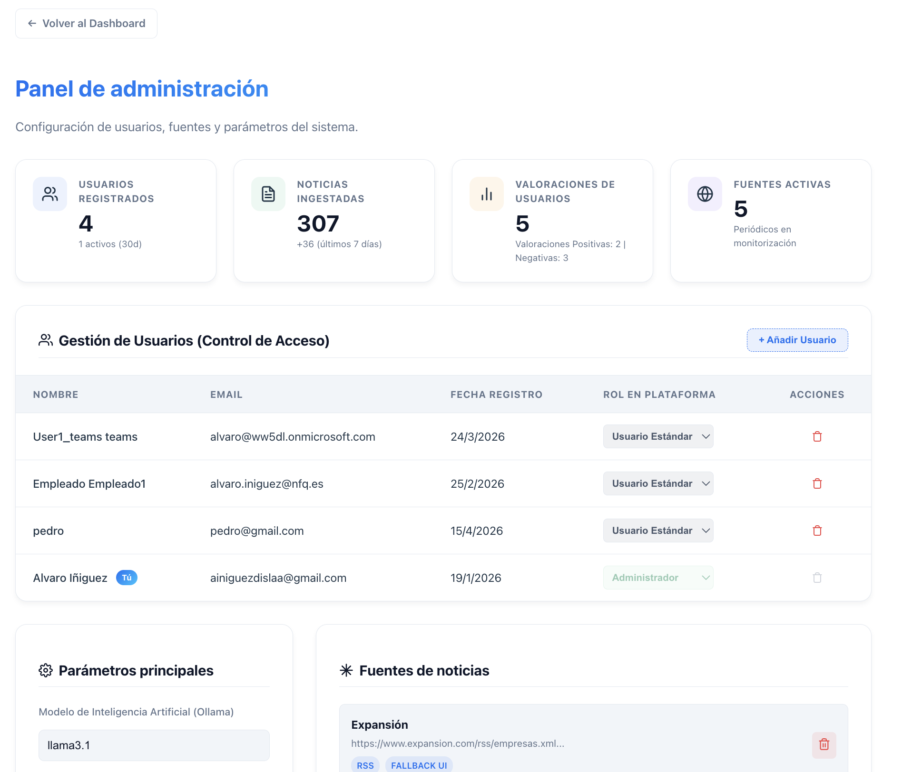

# Guía de usuario de SalesSignalsAI

Esta guía explica cómo usar la aplicación una vez que ya está desplegada y lista para iniciar sesión. Está pensada para cualquier persona que necesite consultar señales comerciales generadas a partir de noticias empresariales procesadas con IA.

> Para instalación, despliegue y configuración técnica del entorno, consulta el [README](README.md).

## Contenido

1. [Objetivo de la aplicación](#objetivo-de-la-aplicación)
2. [Qué hace la aplicación](#qué-hace-la-aplicación)
3. [Tipos de usuario](#tipos-de-usuario)
4. [Antes de empezar](#antes-de-empezar)
5. [Acceder a la aplicación](#acceder-a-la-aplicación)
6. [Usar el dashboard](#usar-el-dashboard)
7. [Consultar el detalle de una noticia](#consultar-el-detalle-de-una-noticia)
8. [Gestionar el perfil de usuario](#gestionar-el-perfil-de-usuario)
9. [Opcional: usar el panel de administración](#opcional-usar-el-panel-de-administración)
10. [Incidencias habituales](#incidencias-habituales)

## Objetivo de la aplicación

SalesSignalsAI es una plataforma web de monitorización de noticias para ventas B2B. Su finalidad es ayudar a identificar oportunidades comerciales a partir de noticias empresariales, priorizarlas por relevancia y mostrar al usuario un análisis útil para la acción comercial.

En lugar de obligar al usuario a revisar manualmente varios periódicos, la aplicación centraliza la información, la deduplica, la clasifica con IA y la presenta en un formato más utilizable para ventas.

En esta guía, una **señal** es una noticia que el sistema ha detectado, procesado y presentado como posible oportunidad comercial.

## Qué hace la aplicación

La aplicación hace lo siguiente:

- Recoge noticias desde varias fuentes.
- Elimina noticias repetidas.
- Analiza cada noticia con IA.
- Asigna una relevancia y una categoría a cada señal.
- Detecta empresas mencionadas.
- Genera un resumen comercial, una guía de conversación y, cuando procede, un borrador de correo.
- Permite filtrar la información desde una interfaz web.
- Personaliza el contenido según el perfil del usuario.
- Permite a un administrador gestionar usuarios y parámetros del sistema.
- Puede enviar notificaciones por Microsoft Teams si esa integración está activada.

## Tipos de usuario

### Usuario estándar

Un usuario estándar puede:

- Iniciar sesión en la aplicación.
- Consultar el dashboard de señales.
- Filtrar noticias.
- Abrir el detalle completo de una noticia.
- Valorar si una señal es útil o no útil.
- Editar su perfil y sus preferencias.

### Administrador

Un administrador puede hacer todo lo anterior y además:

- Acceder al panel de administración.
- Consultar métricas generales del sistema.
- Crear usuarios.
- Cambiar roles de usuario.
- Eliminar usuarios.
- Editar parámetros globales.
- Añadir o eliminar fuentes de noticias.
- Editar las instrucciones base de IA.

## Antes de empezar

Para usar la aplicación solo necesitas:

- La URL donde está desplegada.
- Una cuenta activa.
- Un navegador web actualizado.

Si no puedes iniciar sesión, solicita acceso a un administrador.

## Acceder a la aplicación

### Iniciar sesión

1. Abre la URL donde está desplegada la aplicación.
2. Introduce tu correo electrónico y tu contraseña.
3. Selecciona **Iniciar sesión**.
4. Espera a que se cargue el dashboard principal.

### Opcional: crear una cuenta

Si el despliegue permite auto-registro:

1. En la pantalla de login, selecciona **Regístrate aquí**.
2. Introduce nombre, apellidos, correo y contraseña.
3. Selecciona **Registrarme**.
4. Inicia sesión con la cuenta creada.

Si el acceso está controlado por la organización, solicita el alta a un administrador.

### Recuperar la contraseña

1. En la pantalla de login, selecciona **Recupérala aquí**.
2. Introduce tu correo electrónico.
3. Selecciona **Enviar enlace**.
4. Abre el correo recibido.
5. Sigue el enlace y define una nueva contraseña.

## Usar el dashboard

El dashboard es la pantalla principal de trabajo. Desde aquí se consultan las señales generadas por el sistema.

### Revisar las señales disponibles

Cada tarjeta del dashboard representa una noticia ya procesada. En cada tarjeta se muestra:

- Fecha de publicación.
- Nivel de prioridad: **Alta**, **Media** o **Baja**.
- Marca **NUEVO** si la noticia es reciente.
- Marca **TU CLIENTE** si la noticia menciona una empresa incluida en tu perfil.
- Resumen comercial generado por IA, si está disponible.
- Relevancia estimada.
- Fuente principal.
- Categoría de señal.
- Categoría de producto.
- Empresas detectadas.
- Botones de valoración.
- Enlace a la noticia original.

Para abrir el detalle completo de una señal, pulsa sobre su tarjeta.

### Filtrar la información

En la parte superior del dashboard puedes usar varios filtros:

1. **Buscar señales por título o resumen** para localizar una noticia concreta.
2. **Todas las señales** o **Mis preferencias** para decidir si quieres ver todo el contenido o solo el que encaja con tu perfil.
3. **Más relevantes** o **Más recientes** para cambiar el orden de visualización.
4. **Categoría**, **Producto** y **Empresa** para acotar resultados.
5. **Ocultar noticias de baja relevancia** para limpiar el dashboard de señales menos útiles.

Si quieres volver al estado inicial, selecciona **Limpiar filtros**.

#### Recomendación de uso

Si el dashboard aparece con pocas noticias o sin resultados, revisa estas dos opciones:

1. Cambia la vista de **Mis preferencias** a **Todas las señales**.
2. Completa antes tu perfil con intereses, productos y empresas objetivo.

### Actualizar las noticias manualmente

El botón **Actualizar** ejecuta una recarga manual:

1. Lanza una nueva ingesta de noticias en el backend.
2. Vuelve a consultar la base de datos.
3. Refresca el dashboard con el resultado actualizado.

Este proceso puede tardar un poco más que un refresco visual normal, porque implica extracción, análisis y carga de datos.

#### Nota importante

Aunque pulses **Actualizar**, puede ocurrir que no aparezcan noticias nuevas si:

- Las fuentes externas no tienen novedades.
- Alguna fuente está temporalmente caída o bloqueada.
- Las noticias nuevas se consideran duplicadas respecto a otras ya almacenadas.

### Valorar una señal

Cada tarjeta permite registrar feedback:

- **👍** indica que la señal te parece útil.
- **👎** indica que la señal no te parece útil.

La valoración queda asociada a tu usuario y sirve para registrar interacción y alimentar métricas internas del sistema.

## Consultar el detalle de una noticia

Al abrir una noticia accedes a una pantalla más completa para trabajar la oportunidad.

### Qué información aparece en el detalle

La vista de detalle puede incluir:

- **Análisis de Oportunidad (IA)**: resumen comercial orientado a acción.
- **Guía de Conversación**: puntos clave para preparar una llamada o reunión.
- **Borrador de correo**: propuesta de primer contacto comercial.
- **Resumen Original**: resumen base de la noticia.
- **Relevancia**: puntuación de 0 a 100.
- **Empresas**: entidades detectadas por la IA.
- **Categorías**: señal y categoría de producto.
- **Valoración**: botones para marcar si la señal te ha resultado útil.
- **Leer Noticia Original**: acceso a la fuente externa.

### Trabajar con el detalle

1. Revisa el análisis generado por IA para entender por qué la noticia puede ser útil.
2. Consulta las empresas identificadas para decidir si encaja con tu cartera.
3. Usa la guía de conversación como apoyo para preparar el contacto.
4. Si el borrador de correo está disponible, selecciona **Copiar Email** para reutilizarlo.
5. Contrasta siempre con la noticia original si necesitas contexto adicional.

## Gestionar el perfil de usuario

La página de perfil sirve para adaptar el sistema a tus prioridades comerciales.

### Editar la información personal

1. Abre tu perfil desde el icono de usuario del dashboard.
2. En la tarjeta **Información Personal**, selecciona **Editar**.
3. Modifica nombre y apellidos.
4. Selecciona **Guardar**.

### Cambiar la contraseña

1. En la sección **Seguridad**, selecciona **Cambiar Contraseña**.
2. Confirma el envío del enlace de recuperación.
3. Revisa tu correo y completa el cambio desde el enlace recibido.

### Configurar los intereses de negocio

En la sección **Intereses de Negocio** puedes definir qué tipos de señales te interesan.

1. Abre el selector **+ Añadir interés...**.
2. Elige una categoría.
3. Repite el proceso para añadir más intereses.
4. Si quieres eliminar uno, pulsa la **x** del elemento correspondiente.

Los cambios en esta sección se guardan automáticamente al añadir o eliminar elementos.

### Configurar las líneas de producto

En la sección **Líneas de Producto** puedes indicar qué soluciones gestionas.

1. Abre el selector **+ Añadir producto...**.
2. Elige un producto de la lista.
3. Para eliminarlo, pulsa la **x** del elemento correspondiente.

Los cambios también se guardan automáticamente.

### Añadir empresas objetivo

La sección **Empresas Objetivo** permite marcar clientes o cuentas que quieres seguir más de cerca.

1. Escribe el nombre de la empresa en el campo de entrada.
2. Pulsa **+** o la tecla **Enter**.
3. Repite el proceso para añadir más empresas.
4. Para eliminar una empresa, pulsa la **x** de su etiqueta.

Estas empresas se usan para resaltar noticias relacionadas en el dashboard con la marca **TU CLIENTE**.

Opcional: usar el panel de administración

El acceso al panel de administración solo aparece para usuarios con rol **admin**.

### Acceder al panel

1. Inicia sesión con una cuenta administradora.
2. En el dashboard, selecciona **Panel de administración**.

### Consultar métricas generales

En la cabecera del panel se muestran métricas de seguimiento del sistema:

- Usuarios registrados.
- Noticias ingestadas.
- Valoraciones de usuarios.
- Fuentes activas.

Estas métricas sirven para obtener una visión rápida del estado de uso y actividad de la plataforma.

### Gestionar usuarios

Desde la tabla de usuarios puedes:

1. Revisar nombre, correo, fecha de registro y rol.
2. Cambiar el rol entre **Usuario Estándar** y **Administrador**.
3. Crear un nuevo usuario con **+ Añadir Usuario**.
4. Eliminar usuarios cuando sea necesario.

#### Nota importante

Las acciones de usuarios se aplican directamente al ejecutarlas. No requieren pulsar el botón de guardado general del panel.

### Editar parámetros principales

La sección **Parámetros principales** permite modificar:

- Modelo de IA.
- Umbral de similitud para deduplicación.
- Límite de correos simultáneos.
- Retardo entre correos.

#### Recomendación

No cambies estos valores sin criterio funcional claro. Afectan al comportamiento de futuras ejecuciones del sistema.

### Gestionar fuentes de noticias

La sección **Fuentes de noticias** permite:

1. Revisar las fuentes ya configuradas.
2. Eliminar una fuente existente.
3. Añadir una nueva fuente con nombre, URL principal y URL de respaldo opcional.

#### Nota importante

Añadir o eliminar fuentes en pantalla no completa el cambio por sí solo. Después de ajustar las fuentes, debes seleccionar **Guardar configuración** al final de la página.

### Editar las instrucciones base de IA

La sección **Instrucciones Base de IA** permite modificar el texto base que orienta el análisis automático.

Desde aquí puedes:

- Revisar el texto de instrucciones actualmente activo.
- Ajustar reglas de análisis.
- Restaurar el prompt por defecto.
- Guardar la configuración.

#### Nota importante

Los cambios en las instrucciones de IA afectan a análisis futuros. No reescriben automáticamente las noticias que ya estaban guardadas en la base de datos.

### Guardar la configuración global

Después de cambiar parámetros, fuentes o instrucciones base de IA:

1. Baja hasta el final del panel.
2. Selecciona **Guardar configuración**.
3. Espera el mensaje de confirmación.

Si no guardas, esos cambios no se persistirán.

## Incidencias habituales

### No veo noticias en el dashboard

Posibles causas:

- Estás en **Mis preferencias** y todavía no has configurado tu perfil.
- Has aplicado filtros muy restrictivos.
- No hay noticias nuevas que cumplan esos criterios.

Acción recomendada:

1. Cambia a **Todas las señales**.
2. Limpia filtros.
3. Pulsa **Actualizar**.

### No aparece el botón de administración

Tu cuenta no tiene rol de administrador. En ese caso no puedes acceder al panel admin.

### Pulso actualizar y no cambia nada

Esto no implica necesariamente un fallo. El sistema puede no mostrar novedades si:

- No hay noticias nuevas en las fuentes.
- Alguna fuente externa no responde.
- La deduplicación descarta contenido repetido.

### No recibo avisos por Teams

Las notificaciones por Teams dependen de que esa integración esté activa en el despliegue y correctamente configurada. No todos los entornos tienen esta función habilitada.

## Cierre

La aplicación está diseñada para que el usuario pueda pasar de una noticia detectada a una posible acción comercial con el menor número de pasos posible: revisar, filtrar, analizar, valorar y priorizar.

Como criterio de uso diario:

1. Entra al dashboard.
2. Revisa primero las señales de mayor relevancia.
3. Abre en detalle las noticias que encajen con tu cartera o tus intereses.
4. Ajusta el perfil para mejorar la personalización.
5. Si eres administrador, revisa periódicamente usuarios, fuentes y configuración.

Si vas a incorporar esta guía a la memoria del TFG, procura que todas las capturas:

- estén hechas con el mismo navegador y el mismo tamaño de ventana,
- muestren solo la parte relevante de la pantalla,
- eviten datos sensibles reales,
- y lleven un pie breve y descriptivo.
